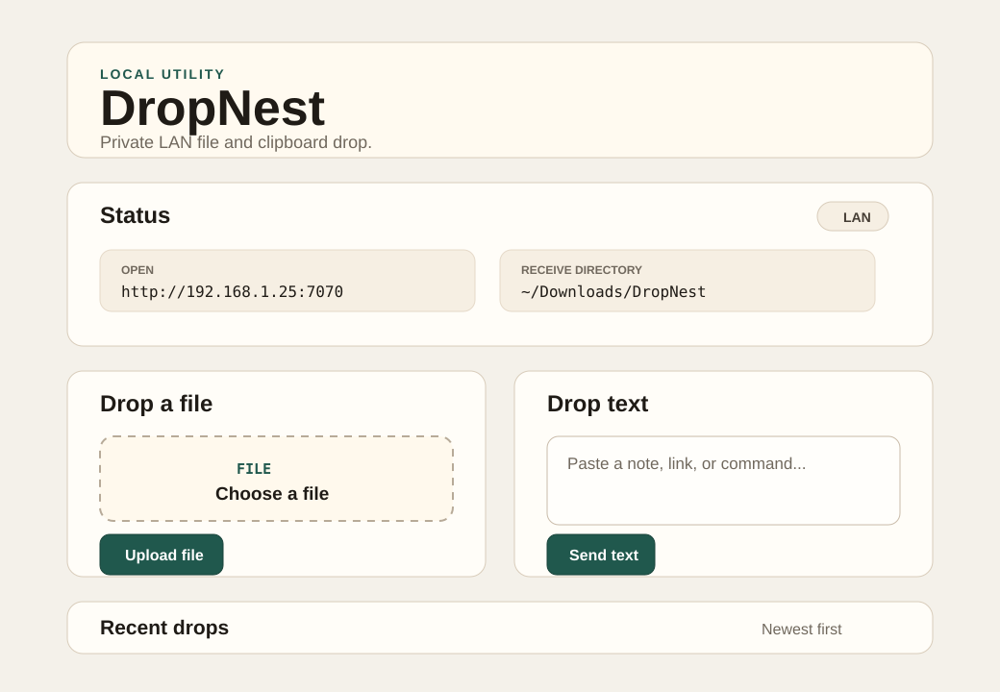

# DropNest

DropNest is a small local dropbox for your own machines. run it on one computer, open the address from another phone, laptop, steam deck, or anything else on the same wi-fi, then send over a file or a chunk of text without making an account or pushing anything through a cloud service.

it is meant for the boring little transfers that should not need a chat app, email draft, cloud drive, or usb cable. the computer running DropNest is the host. uploads land in the folder you choose on that host, text drops stay in local metadata, and the web page gives you copy, download, and delete buttons for recent drops.



## what it does

- starts in local-only mode unless you ask for LAN mode
- opens to your network with `--lan`
- can require a simple PIN with `--pin`
- lets you choose the receive folder with `--dir`
- can read defaults from `dropnest.conf`
- saves uploaded files on the host computer, not on the device that uploaded them
- accepts pasted text, links, commands, notes, and clipboard bits
- adds local drops from the CLI with `send` and `send-text`
- shows a fully offline QR code for quick phone setup
- supports drag-and-drop file upload in the browser
- lets each drop expire after 15 minutes, 1 hour, 1 day, 1 week, or never
- shows recent drops with copy, download, and delete actions
- stores metadata locally in `data/metadata.json`
- stores uploaded file content under the receive directory
- cleans up expired drops automatically
- uses plain server-rendered HTML and CSS, so there is no frontend build step

the app is written in Gleam and runs on Erlang/BEAM through Wisp and Mist. release builds do not need Gleam installed, but they do need Erlang.

## install a release

DropNest releases are shipped as a Gleam Erlang shipment archive. the installer downloads the archive, verifies the checksum when available, and creates a small `dropnest` wrapper in your install directory.

the commands below install from the upstream GitHub releases. if you publish a fork under another GitHub account or organization, set `GITHUB_OWNER` and `GITHUB_REPO` before running the installer.

safer install, because you can read the script first:

```sh
curl -fsSL https://raw.githubusercontent.com/RobertFlexx/dropnest/main/install.sh -o install.sh
sh install.sh
```

one-line install, if you are comfortable piping the installer straight into `sh`:

```sh
curl -fsSL https://raw.githubusercontent.com/RobertFlexx/dropnest/main/install.sh | sh
```

the installer puts `dropnest` in `$HOME/.local/bin` unless you set `INSTALL_DIR`.

installing from a fork looks like this:

```sh
GITHUB_OWNER=your-github-user GITHUB_REPO=dropnest sh install.sh
```

```sh
dropnest serve
```

to use it from another device on your wi-fi:

```sh
dropnest serve --lan --pin 1234 --dir ~/Downloads/DropNest
```

then open one of the shown addresses from the other device. if DropNest cannot detect a usable local address and shows `<your-computer-ip>`, replace it with the host computer's local network IP address.

## erlang requirement

release builds need Erlang because DropNest is a Gleam/BEAM app. they do not need Gleam.

common install commands:

```sh
# debian or ubuntu
sudo apt install erlang

# fedora
sudo dnf install erlang

# arch
sudo pacman -S erlang

# macos
brew install erlang
```

## build from source

```sh
git clone https://github.com/RobertFlexx/DropNest
cd DropNest
gleam deps download
gleam build
gleam run -- serve
```

## everyday use

local-only mode is the default and is only reachable from the host computer:

```sh
gleam run -- serve
```

show help:

```sh
gleam run -- help
gleam run -- serve --help
```

choose where files are saved:

```sh
gleam run -- serve --dir ~/DropNest
```

open it to your wi-fi, require a PIN, and save uploads in a dedicated folder:

```sh
gleam run -- serve --lan --pin 1234 --dir ~/Downloads/DropNest
```

set the host and port yourself:

```sh
gleam run -- serve --lan --host 0.0.0.0 --port 7070 --dir ~/Downloads/DropNest
```

## options

- `serve` starts the web server
- `--lan` binds to `0.0.0.0` unless `--host` is also set
- `--host <host>` chooses the bind host
- `--port <port>` chooses the port, defaulting to `7070`
- `--pin <pin>` turns on simple PIN protection
- `--dir <path>` chooses the receive folder, defaulting to `./DropNestDrops`
- `--data-dir <path>` chooses where metadata is written, defaulting to `./data`
- `--max-upload-mb <number>` sets the upload limit, defaulting to `100`

DropNest lists usable local IPv4 addresses in LAN mode. if more than one address is shown, use the one that belongs to the same wi-fi or wired network as your other device.

## config file

DropNest reads `./dropnest.conf` when it exists. pass `--config <path>` if you want to keep it somewhere else. command-line options win over config-file values.

```conf
lan=true
pin=1234
dir=/home/you/Downloads/DropNest
data_dir=/home/you/.local/share/dropnest
host=0.0.0.0
port=7070
max_upload_mb=250
expires=1440
```

`expires=0` keeps drops forever. because the PIN can live in this file, local `dropnest.conf` files are ignored by git. use `dropnest.example.conf` as the template.

## cli sends

these commands add drops directly to the configured local DropNest storage. they do not need the web server to be running.

```sh
dropnest send-text "open this on the other machine"
dropnest send ./archive.zip --dir ~/Downloads/DropNest
```

## where files go

by default DropNest writes this shape of data next to where you started it:

```text
data/
  metadata.json

DropNestDrops/
  <generated-id>
  <generated-id>
```

original filenames are kept for display and download names. stored files use generated IDs, so a browser upload cannot choose the final path on disk.

## routes

- `GET /` shows the homepage
- `POST /drops/file` uploads a file
- `POST /drops/text` creates a text drop
- `GET /drops` returns metadata JSON
- `GET /drops/:id/download` downloads a file drop
- `POST /drops/:id/delete` deletes a drop
- `GET /health` returns a basic health check

## safety notes

- DropNest binds to `127.0.0.1` by default
- LAN access only happens when you pass `--lan`
- use `--pin` in LAN mode unless you trust everyone on that network
- the PIN is useful on a normal home LAN, but it is not meant to protect an internet-facing service
- uploaded filenames are never used as storage paths
- browser clients cannot choose final filesystem paths
- file content is served by generated drop ID
- user-controlled text is escaped before it is rendered in HTML
- expired and deleted file drops remove stored file content
- do not use `/`, `.`, or a broad project folder as the receive directory

## troubleshooting

if your phone cannot open DropNest, make sure both devices are on the same wi-fi, start with `--lan`, use the host computer's real local IP address, and check the host firewall.

if `--dir ~/Downloads/DropNest` is rejected, pass it unquoted so your shell expands `~`, or use an absolute path like `/home/you/Downloads/DropNest`.

if uploads fail, check that the receive directory can be created and written by your user, check the upload limit on the homepage, or restart with a larger limit like `--max-upload-mb 250`.

if metadata gets corrupted, DropNest backs it up as `metadata.corrupt.<timestamp>.json` and starts with fresh metadata.

## release build

release builders need Gleam, Erlang, and Rebar3.

```sh
scripts/package-release.sh
scripts/verify-release.sh
```

artifacts are written to `dist/`.

## manual test list

```text
[ ] gleam deps download
[ ] gleam build
[ ] gleam run -- serve
[ ] local homepage opens
[ ] gleam run -- serve --lan --pin 1234 --dir ~/Downloads/DropNest
[ ] LAN homepage opens from another device
[ ] receive directory is created
[ ] homepage shows receive directory
[ ] file upload from another device saves on host
[ ] uploaded file appears in recent drops
[ ] file downloads with original filename
[ ] file delete removes metadata and stored file
[ ] text drop submits
[ ] blank text drop is rejected
[ ] copy button works
[ ] oversized file is rejected
[ ] expired drops are cleaned
[ ] missing file download gives a friendly error
```

## project layout

```text
.github/workflows/release.yml  GitHub release packaging workflow
docs/dropnest-preview.svg      README preview image
scripts/package-release.sh     local release archive builder
scripts/verify-release.sh      release archive verification
gleam.toml
dropnest.example.conf          config template
src/dropnest.gleam             cli entrypoint
src/dropnest/config.gleam      defaults and argument parsing
src/dropnest/drop.gleam        drop model and JSON encoding/decoding
src/dropnest/net.gleam         LAN address helpers
src/dropnest/server.gleam      Wisp/Mist server and routes
src/dropnest/storage.gleam     safe local storage and expiration cleanup
src/dropnest/view.gleam        plain HTML/CSS/QR rendering
src/dropnest_ffi.erl           small Erlang network interface helper
test/dropnest_test.gleam       smoke and regression tests
```

## later ideas

- upload progress polish
- CLI helpers for listing and cleaning drops
- optional device names
- search and tags
- burn-after-download
- systemd user service example
- broader automated tests
